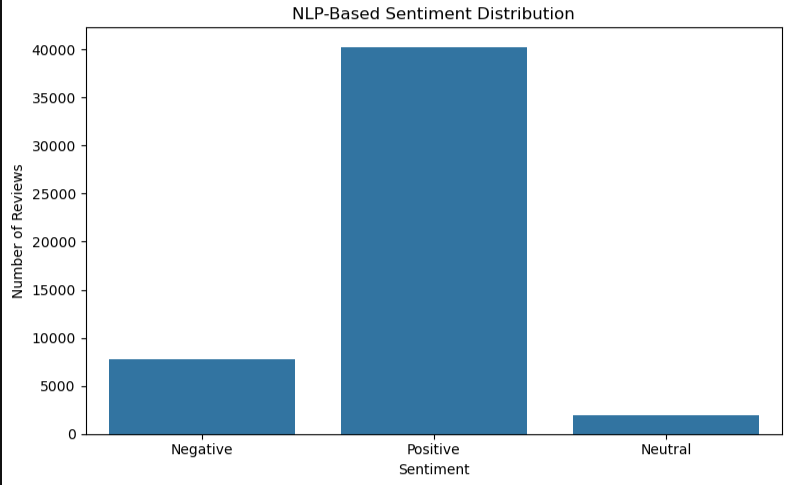
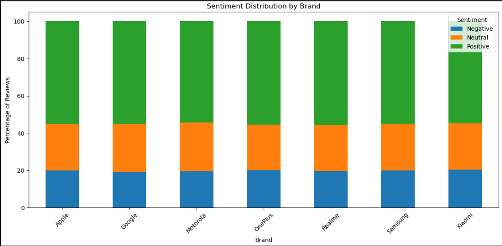
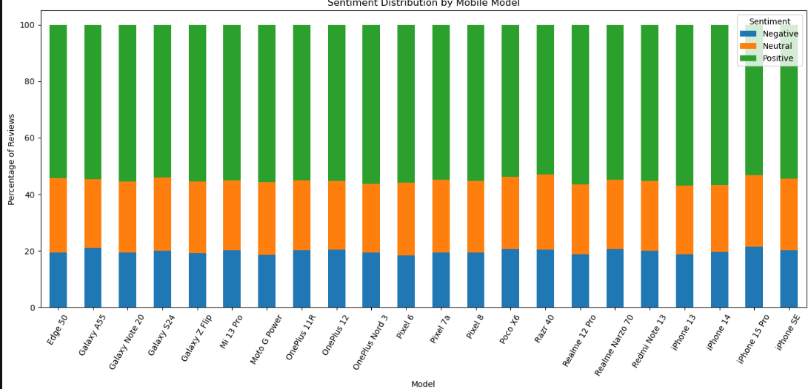
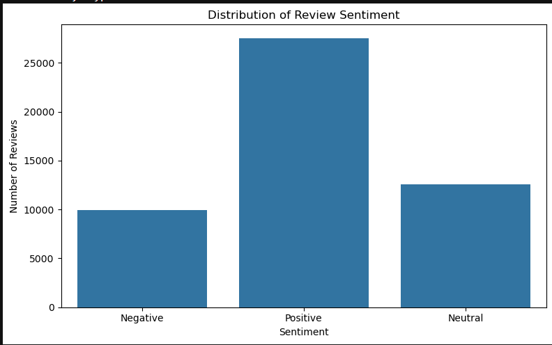
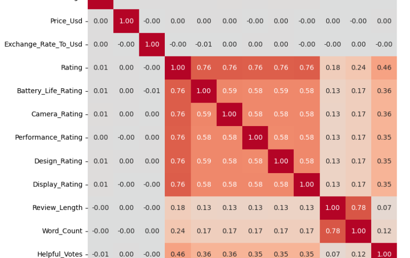

# CodeAlpha-Mobile-Reviews-Sentiment-Analysis

##  Project Overview
This project analyzes mobile phone customer reviews using Python, Natural Language Processing (NLP) and sentiment analysis. The objective is to transform unstructured customer reviews into actionable insights about customer satisfaction, product performance, public opinion, and consumer behavior. The analysis examines customer sentiment across mobile brands, models, review sources, countries, verified purchases, product features, and time.

##  Project Objectives
- Analyze customer review text and classify reviews as Positive, Negative, or Neutral.
- Analyze reviews from different sources, including online marketplaces, social media, and news platforms.
- Identify public opinion and sentiment trends across brands, models, countries, and time.
- Generate actionable insights to support marketing, product development, and customer experience.

##  Tools & Technologies
- Python
- Jupyter Notebook
- Pandas
- NumPy
- Matplotlib
- Seaborn
- TextBlob
- Scikit-learn
- SciPy
- Natural Language Processing (NLP)

##  Dataset
The dataset contains mobile phone customer reviews and product-related information.
Key variables include:
- Brand
- Model
- Rating
- Review_Text
- Sentiment
- Country
- Language
- Review_Date
- Verified_Purchase
- Battery_Life_Rating
- Camera_Rating
- Performance_Rating
- Design_Rating
- Display_Rating
- Review_Length
- Word_Count
- Helpful_Votes
- Source

##  Methodology
Data Cleaning
- Checked missing values
- Checked duplicate records
- Validated data types
- Cleaned review text
- Converted dates
- Prepared numerical variables

Exploratory Data Analysis
The project analyzed:
- Sentiment distribution
- Customer ratings
- Sentiment by brand
- Sentiment by model
- Sentiment by country
- Sentiment by review source
- Verified purchase status
- Product feature ratings
- Review length
- Word count
- Helpful votes

NLP Sentiment Analysis
Natural Language Processing was applied to customer review text to classify reviews as:
- Positive
- Negative
- Neutral
The NLP-generated sentiment was compared with the existing sentiment labels in the dataset.

Trend Analysis
Customer sentiment was analyzed over time to identify changes in public opinion.

Text Analysis
Frequently used words were analyzed to identify common themes in customer feedback.

##  Key Findings
Customer Satisfaction
Overall customer sentiment was analyzed to determine the dominant opinion toward mobile products.

Product Features
Overall Rating showed a strong positive relationship of approximately 0.76 with:
- Battery Life
- Camera
- Performance
- Design
- Display
This suggests that customer evaluations of individual product features are strongly associated with their overall assessment of a mobile phone.

Review Characteristics
Review_Length and Word_Count showed a strong positive correlation of approximately 0.78, indicating that longer reviews generally contain more words.

Customer Engagement
Rating and Helpful_Votes showed a moderate positive correlation of approximately 0.46, suggesting that higher-rated reviews tended to receive more helpful votes.

Price
Price_Usd showed little to no linear correlation with most of the numerical variables analyzed in the dataset.

##  Visualizations

### NLP-Based Sentiment Analysis

### Sentiment by Brand

### Sentiment by Model

### Sentiment Distribution

### Sentiment Heatmap

     

##  Business Insights
The analysis demonstrates how customer review data can support:
- Marketing strategy
- Product development
- Customer experience improvement
- Brand monitoring
- Public opinion analysis

## Recommendations
- Improve product features associated with negative customer feedback.
- Use positive customer experiences to strengthen marketing campaigns.
- Monitor sentiment across different review sources.
- Track changes in customer opinion over time.
- Use customer feedback to guide future product development.
- Investigate recurring issues in negative reviews.

## Author
Favour Uchendu
Data Analyst | Python | SQL | Power BI | Excel | Data Visualization | NLP

